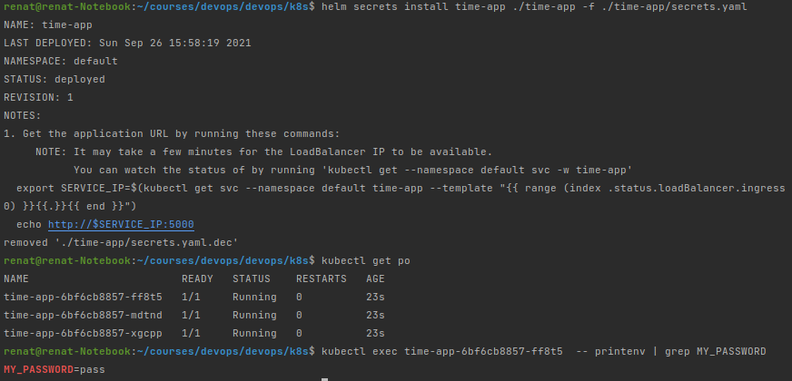

# Lab 11: K8s secrets and resources
## Secrets management


`kubectl create secret generic some-random-pass 
--from-file=./username.txt 
--from-file=./password.txt
`


Command for deleting secret: `kubectl delete secret some-random-pass`


Chart upgrade didn't work for me, so I reinstalled it


After reinstallation:


## Resource management

Edited [values.yaml](./time-app/values.yaml) template to enable resource constraints:
```yaml
resources:
  # We usually recommend not to specify default resources and to leave this as a conscious
  # choice for the user. This also increases chances charts run on environments with little
  # resources, such as Minikube. If you do want to specify resources, uncomment the following
  # lines, adjust them as necessary, and remove the curly braces after 'resources:'.
  # 0.1 = 100m
   limits:
     cpu: 250m
     memory: 256Mi
   requests:
     cpu: 100m
     memory: 128Mi
```

Verifying, that it works:

