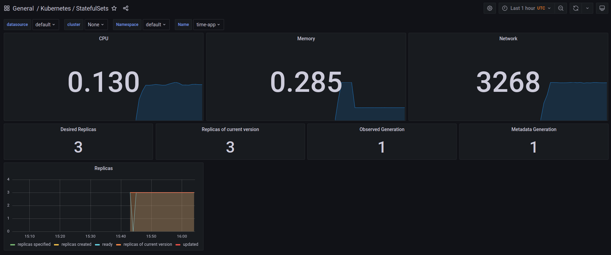
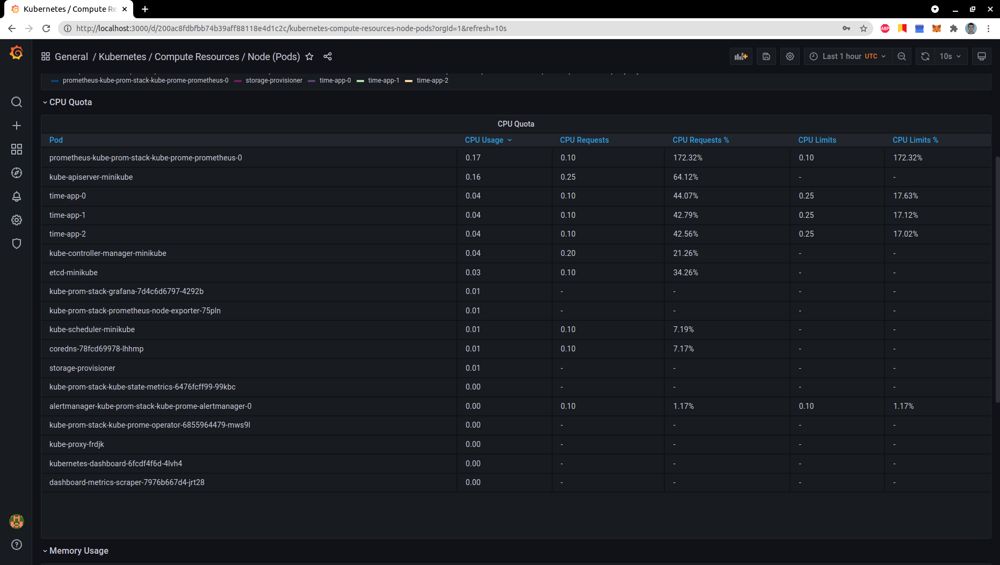
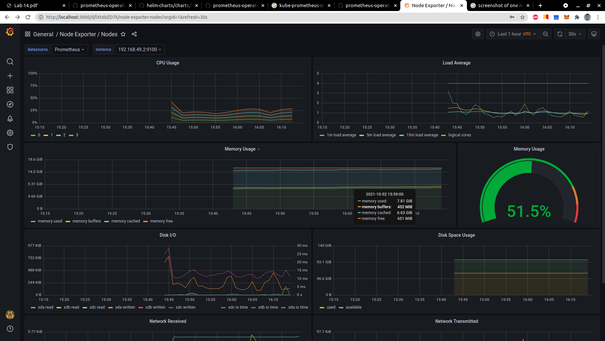
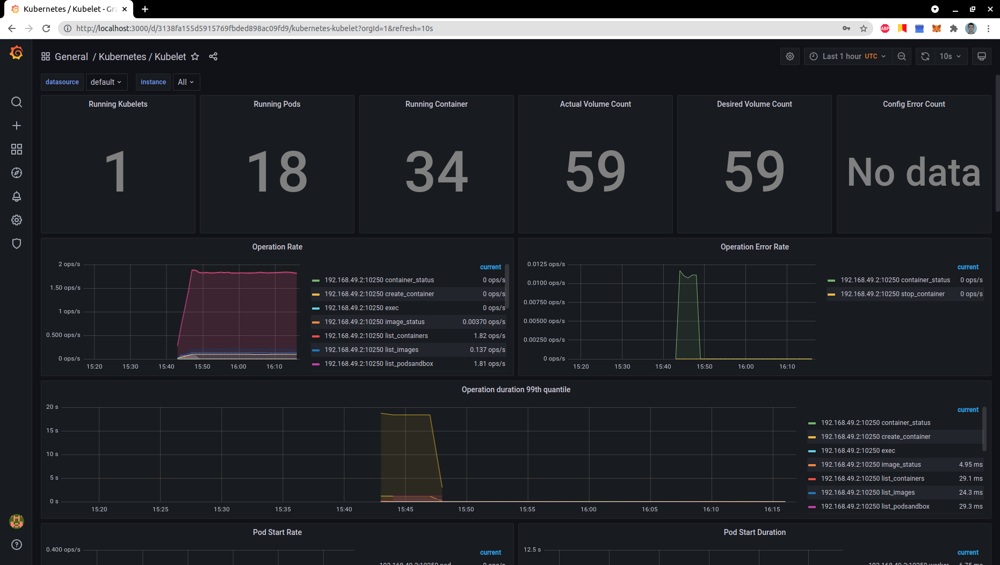
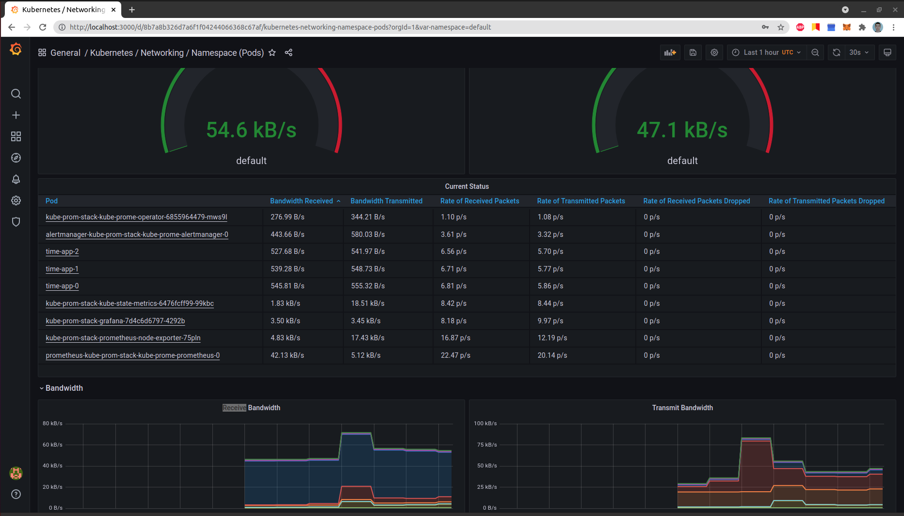
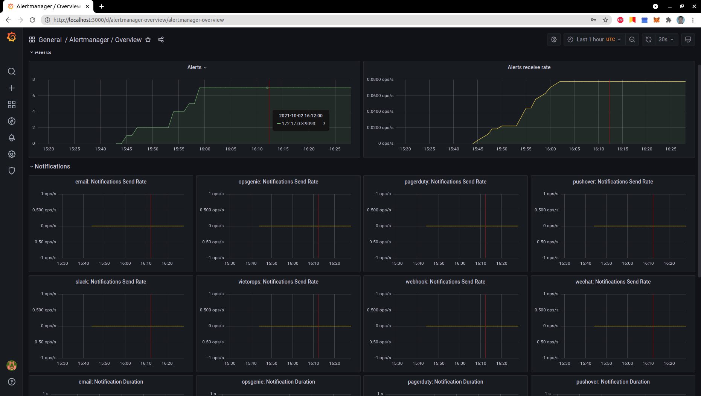
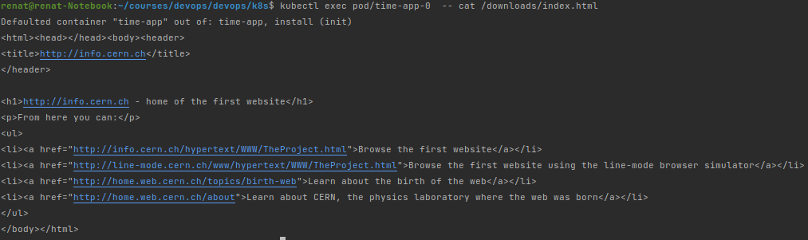

# Cluster monitoring with Prometheus

## Components of the stack and their purposes
* **Prometheus operator** 
> Simplify and automate the configuration of a Prometheus 
* **Prometheus** 
> Prometheus itself - monitoring and alerting
* **AlertManager**
> Handle alerts(deduplication, grouping, routing to correct receivers) from applications
* **Prometheus node-exporter** 
> Handle OS and hardware metrics from *NIX kernels
* **Prometheus Adapter for Kubernetes Metrics APIs** 
> Resource, custom, external metrics APIs. Provides ability to customize metrics.
* **kube-state-metrics** 
> Generates metrics about the state of the object from Kubernetes API without modifications.
* **Grafana** 
> Provides nice dashboards for metrics

## Installation
```bash
> helm repo add prometheus-community https://prometheus-community.github.io/helm-charts
"prometheus-community" has been added to your repositories
> helm repo update
Hang tight while we grab the latest from your chart repositories...
...Successfully got an update from the "prometheus-community" chart repository
Update Complete. ⎈Happy Helming!⎈
> helm install kube-prom-stack  prometheus-community/kube-prometheus-stack
*some W10002 warnings*
NAME: kube-prom-stack
LAST DEPLOYED: Sat Oct  2 18:41:20 2021
NAMESPACE: default
STATUS: deployed
REVISION: 1
NOTES:
kube-prometheus-stack has been installed. Check its status by running:
  kubectl --namespace default get pods -l "release=kube-prom-stack"
> helm secrets install time-app ./time-app -f ./time-app/secrets.yaml 
NAME: time-app
LAST DEPLOYED: Sat Oct  2 18:43:37 2021
NAMESPACE: default
STATUS: deployed
REVISION: 1
NOTES:
1. Get the application URL by running these commands:
     NOTE: It may take a few minutes for the LoadBalancer IP to be available.
           You can watch the status of by running 'kubectl get --namespace default svc -w time-app'
  export SERVICE_IP=$(kubectl get svc --namespace default time-app --template "{{ range (index .status.loadBalancer.ingress 0) }}{{.}}{{ end }}")
  echo http://$SERVICE_IP:5000
removed './time-app/secrets.yaml.dec'
> kubectl get po,sts,svc,pvc,cm
NAME                                                         READY   STATUS    RESTARTS   AGE
pod/alertmanager-kube-prom-stack-kube-prome-alertmanager-0   2/2     Running   0          2m17s
pod/kube-prom-stack-grafana-7d4c6d6797-4292b                 2/2     Running   0          2m28s
pod/kube-prom-stack-kube-prome-operator-6855964479-mws9l     1/1     Running   0          2m28s
pod/kube-prom-stack-kube-state-metrics-6476fcff99-99kbc      1/1     Running   0          2m28s
pod/kube-prom-stack-prometheus-node-exporter-75pln           1/1     Running   0          2m28s
pod/prometheus-kube-prom-stack-kube-prome-prometheus-0       2/2     Running   0          2m16s
pod/time-app-0                                               1/1     Running   0          23s
pod/time-app-1                                               1/1     Running   0          23s
pod/time-app-2                                               1/1     Running   0          23s

NAME                                                                    READY   AGE
statefulset.apps/alertmanager-kube-prom-stack-kube-prome-alertmanager   1/1     2m17s
statefulset.apps/prometheus-kube-prom-stack-kube-prome-prometheus       1/1     2m16s
statefulset.apps/time-app                                               3/3     23s

NAME                                               TYPE           CLUSTER-IP       EXTERNAL-IP   PORT(S)                      AGE
service/alertmanager-operated                      ClusterIP      None             <none>        9093/TCP,9094/TCP,9094/UDP   2m17s
service/kube-prom-stack-grafana                    ClusterIP      10.107.246.183   <none>        80/TCP                       2m28s
service/kube-prom-stack-kube-prome-alertmanager    ClusterIP      10.97.50.89      <none>        9093/TCP                     2m28s
service/kube-prom-stack-kube-prome-operator        ClusterIP      10.106.235.125   <none>        443/TCP                      2m28s
service/kube-prom-stack-kube-prome-prometheus      ClusterIP      10.96.113.107    <none>        9090/TCP                     2m28s
service/kube-prom-stack-kube-state-metrics         ClusterIP      10.111.159.234   <none>        8080/TCP                     2m28s
service/kube-prom-stack-prometheus-node-exporter   ClusterIP      10.108.142.97    <none>        9100/TCP                     2m28s
service/kubernetes                                 ClusterIP      10.96.0.1        <none>        443/TCP                      15d
service/prometheus-operated                        ClusterIP      None             <none>        9090/TCP                     2m16s
service/time-app                                   LoadBalancer   10.108.247.139   <pending>     5000:31390/TCP               23s

NAME                                      STATUS   VOLUME                                     CAPACITY   ACCESS MODES   STORAGECLASS   AGE
persistentvolumeclaim/visits-time-app-0   Bound    pvc-04306611-512d-4686-8def-8c7b06fd5782   256M       RWO            standard       152m
persistentvolumeclaim/visits-time-app-1   Bound    pvc-9f2740b2-93f6-4f80-8810-e96cc1d65463   256M       RWO            standard       152m
persistentvolumeclaim/visits-time-app-2   Bound    pvc-e40c8878-9928-4ac9-94c4-420ad0fe8e79   256M       RWO            standard       152m

NAME                                                                     DATA   AGE
configmap/config                                                         0      6d
configmap/kube-prom-stack-grafana                                        1      2m29s
configmap/kube-prom-stack-grafana-config-dashboards                      1      2m29s
configmap/kube-prom-stack-grafana-test                                   1      2m29s
configmap/kube-prom-stack-kube-prome-alertmanager-overview               1      2m29s
configmap/kube-prom-stack-kube-prome-apiserver                           1      2m29s
configmap/kube-prom-stack-kube-prome-cluster-total                       1      2m29s
configmap/kube-prom-stack-kube-prome-controller-manager                  1      2m29s
configmap/kube-prom-stack-kube-prome-etcd                                1      2m29s
configmap/kube-prom-stack-kube-prome-grafana-datasource                  1      2m29s
configmap/kube-prom-stack-kube-prome-k8s-coredns                         1      2m29s
configmap/kube-prom-stack-kube-prome-k8s-resources-cluster               1      2m29s
configmap/kube-prom-stack-kube-prome-k8s-resources-namespace             1      2m29s
configmap/kube-prom-stack-kube-prome-k8s-resources-node                  1      2m29s
configmap/kube-prom-stack-kube-prome-k8s-resources-pod                   1      2m29s
configmap/kube-prom-stack-kube-prome-k8s-resources-workload              1      2m29s
configmap/kube-prom-stack-kube-prome-k8s-resources-workloads-namespace   1      2m29s
configmap/kube-prom-stack-kube-prome-kubelet                             1      2m29s
configmap/kube-prom-stack-kube-prome-namespace-by-pod                    1      2m29s
configmap/kube-prom-stack-kube-prome-namespace-by-workload               1      2m29s
configmap/kube-prom-stack-kube-prome-node-cluster-rsrc-use               1      2m29s
configmap/kube-prom-stack-kube-prome-node-rsrc-use                       1      2m29s
configmap/kube-prom-stack-kube-prome-nodes                               1      2m29s
configmap/kube-prom-stack-kube-prome-persistentvolumesusage              1      2m29s
configmap/kube-prom-stack-kube-prome-pod-total                           1      2m29s
configmap/kube-prom-stack-kube-prome-prometheus                          1      2m29s
configmap/kube-prom-stack-kube-prome-proxy                               1      2m29s
configmap/kube-prom-stack-kube-prome-scheduler                           1      2m29s
configmap/kube-prom-stack-kube-prome-statefulset                         1      2m29s
configmap/kube-prom-stack-kube-prome-workload-total                      1      2m29s
configmap/kube-root-ca.crt                                               1      15d
configmap/prometheus-kube-prom-stack-kube-prome-prometheus-rulefiles-0   28     2m16s
configmap/time-app                                                       1      23s
```

## `kubectl get po,sts,svc,pvc,cm`
Shows info about running pods, stateful sets, services, persistentvolumeclaim, configmap

## Useful commands
Forward port to grafana pod 
```bash
> kubectl --namespace default port-forward pod/kube-prom-stack-grafana-7d4c6d6797-4292b 3000
```

Forward port to alertmanager
```bash
> kubectl --namespace default port-forward pod/alertmanager-kube-prom-stack-kube-prome-alertmanager-0 9093
```

## Grafana

1. Check how much CPU and Memory your StatefulSet is consuming - ~285 Mb and ~13% of CPU 

2. Check which Pod is using CPU more than others and which is less in the default namespace - 
kube-apiserver-minikube more than others, storage provisioner less than others (at this time)

3. Check how much memory is used on your node, in % and mb. - ~51% used, 7.91 GB 

4. Check how many pods and containers actually ran by the Kubelet service. - 18 pods, 34 containers

5. Check which Pod is using network more than others and which is less in the default namespace - 
prometheus more than others, prom-operator less than others (bandwidth received)

6. Check how many alerts you have. - 7


## Init container
