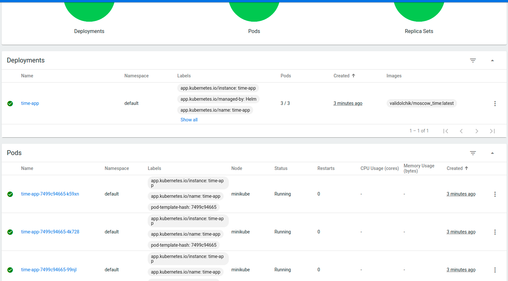

# k8s

## Deployment without a manifests
To make persistent tunnel to service inside the minikube containers, 
the `minikube tunnel` should be executed

`kubectl get svc` and `kubectl get pods`

## Deployment using manifests

## Helm

