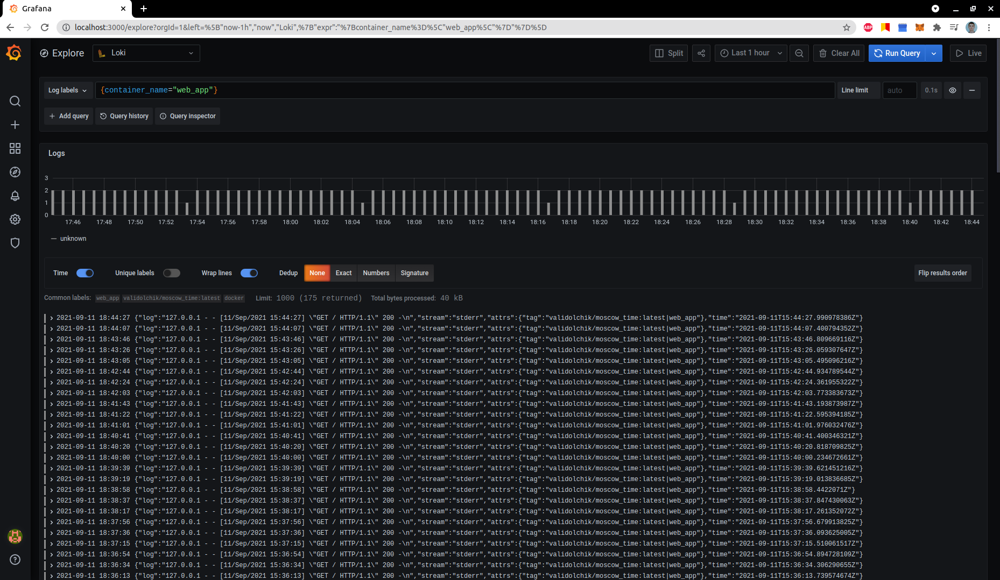
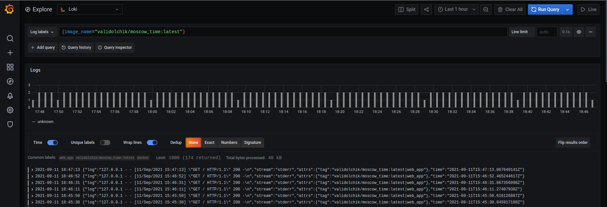
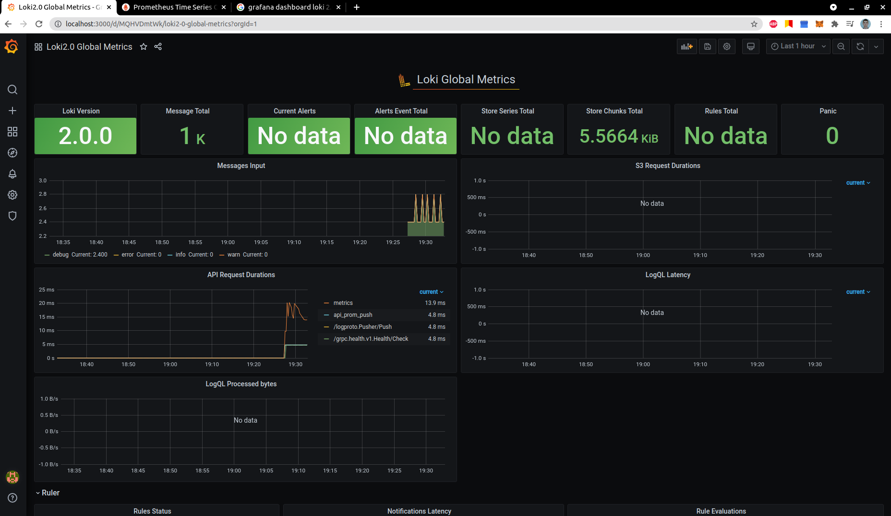
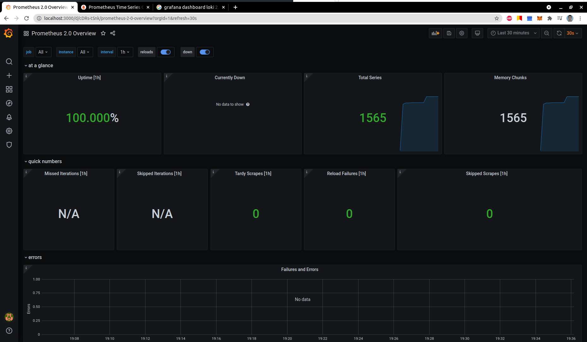
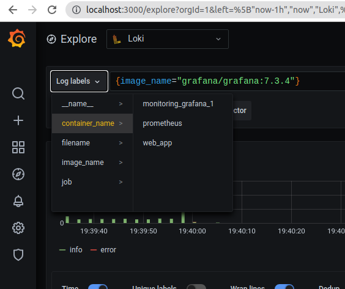

# Monitoring: logging

## What is used
Used `Promtail > Loki > Grafana` stack.

## Proof of work

Overall info from Grafana, we can look at container using its name

Or, by image name

## Best practices

### Loki

According to [official documentation](https://grafana.com/docs/loki/latest/best-practices/)
* Static labels are good
* Use dynamic labels sparingly
* Label values must always be bounded
* Be aware of dynamic labels applied by clients
* Configure caching
* Logs must be in increasing time order per stream
* Use `chunk_target_size`
* Use `-print-config-stderr` or `-log-config-reverse-order`

### Grafana

Read more [here](https://grafana.com/docs/grafana/latest/best-practices/)

#### Related to creating the dashboards
* A dashboard should tell a story or answer a question
* Dashboards should reduce cognitive load, not add to it
* When creating a new dashboard, make sure it has a meaningful name.
* If you create many related dashboards, think about how to cross-reference them for easy navigation.
* Avoid unnecessary dashboard refreshing to reduce the load on the network or backend.
* Use the left and right Y-axes when displaying time series with different units or ranges.
* Add documentation to dashboards and panels.
* Reuse your dashboards and enforce consistency by using templates and variables.
* Be careful with stacking graph data.

    The visualizations can be misleading, and hide important data. Recommended turning it off in most cases.

## Metrics

### Working dashboards

### Services' logs

## P.S.

All commented lines in [docker-compose](docker-compose.yml) 
will be included, when appropriate technology will be needed

## TODO

yml config cheetsheet to create template for logging
